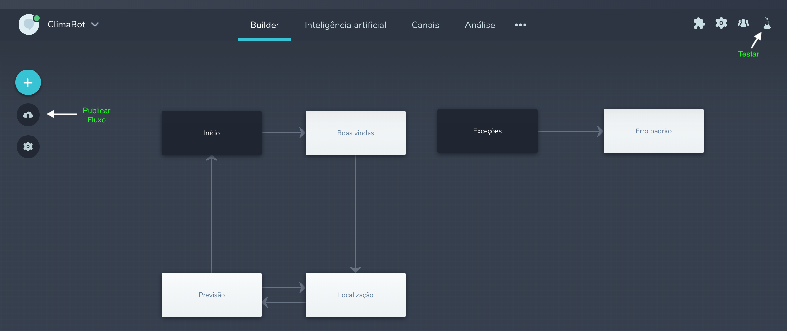

# Chatbot: Estudo de caso com o BLiP

## Cadastro

Realizar cadastro 

[https://blip.ai/](https://blip.ai/)

* Mail de ativação
* Pode colocar um telefone fixo

## Prática

Criar chatbot de tempo \(entrega informações climáticas baseadas na localização do usuário\)

Fonte:

[https://www.youtube.com/watch?time\_continue=63&v=tEhJBumWPkc](https://www.youtube.com/watch?time_continue=63&v=tEhJBumWPkc)

### 1 - Cadastro na Dark Sky

[https://darksky.net/dev](https://darksky.net/dev)

Conta para acesso a API e receber a key

#### Forecast Request

```text
https://api.darksky.net/forecast/[key]/[latitude],[longitude]
```

### 2 - Criando o bot no blip



## Para saber mais

{% embed data="{\"url\":\"https://medium.com/@ravpacheco/dentre-tantas-plataformas-por-que-o-blip-4228980dea43\",\"type\":\"link\",\"title\":\"Dentre tantas plataformas de bots, por que o BLiP ?\",\"description\":\"Apesar de não ser novo, o termo bot \(ou chatterbot, chatbot, contatos inteligentes, robôs de mensagem, entre outros…\) tem ganhado grande…\",\"icon\":{\"type\":\"icon\",\"url\":\"https://cdn-images-1.medium.com/fit/c/304/304/1\*8I-HPL0bfoIzGied-dzOvA.png\",\"width\":152,\"height\":152,\"aspectRatio\":1},\"thumbnail\":{\"type\":\"thumbnail\",\"url\":\"https://cdn-images-1.medium.com/max/2000/1\*hQq0yD2mdon2FRW1kdRp7Q.png\",\"width\":1364,\"height\":768,\"aspectRatio\":0.5630498533724341}}" %}

## Resumo

Quais as etapas foram realizadas para chegar neste momento


```
Cadastro no blip.ai
Cadastro na dark sky
Utilizar no bot a key gerada na dark sky
"Programar" o comportamento do bot
Publicar o bot
Testar o bot
```

O resultado final pode ser visto em:



