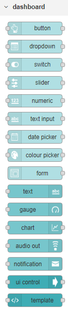

# Node-RED

## Node-RED

O Node-RED é "a programming tool for wiring together hardware devices, APIs and online services in new and interesting ways.

It provides a browser-based editor that makes it easy to wire together flows using the wide range of nodes in the palette that can be deployed to its runtime in a single-click".

Para instalá-lo:

```text
$ npm install -g --unsafe-perm node-red
```

Terminado de instalar basta digitar `node-red` no CLI


No navegador ir para [http://127.0.0.1:1880](http://127.0.0.1:1880)

Será apresentada a tela inicial do Node-red


Muitos módulos podem ser adicionados ao Node-red \(faremos uma prática com o pacote de Dashboard\)

Alguns módulos legais:

* firebase - [https://www.npmjs.com/package/node-red-contrib-firebase](https://www.npmjs.com/package/node-red-contrib-firebase)
* arduino - [https://www.npmjs.com/package/node-red-node-arduino](https://www.npmjs.com/package/node-red-node-arduino)

Para saber mais sobre o Node-RED, acesse este link:

[https://medium.com/node-red](https://medium.com/node-red)

## Criando um Dashboard {#criando-um-cv}

Para a instalação do módulo de Dasboard

```text
$ npm i node-red-dashboard
```

A partir desse momento o módulo de dashboard é incorporado ao Node



No navegador abrir outra janela

[http://localhost:1880/ui](http://localhost:1880/ui%20)

Exemplo:

[https://github.com/SenseTecnic/tutorial-samples/tree/master/node-red-contrib-dashboard](https://github.com/SenseTecnic/tutorial-samples/tree/master/node-red-contrib-dashboard)

1. Importar do clipboard
2. Deploy

## Mais exemplos {#subindo-cv}

[http://noderedguide.com/examples/](http://noderedguide.com/examples/) 

## Resumo {#resumo}

Quais as etapas foram realizadas para chegar neste momento

​

```text
Instalar o Node-Red
Instalar o módulo de dashboard
Importar arquivo do repositório exemplo
Publicar (deploy) do exemplo
```

